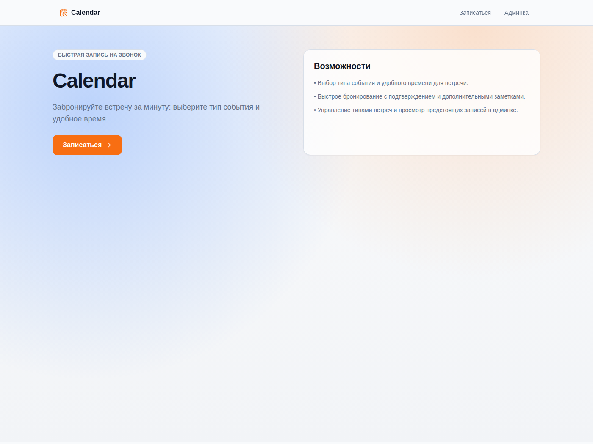
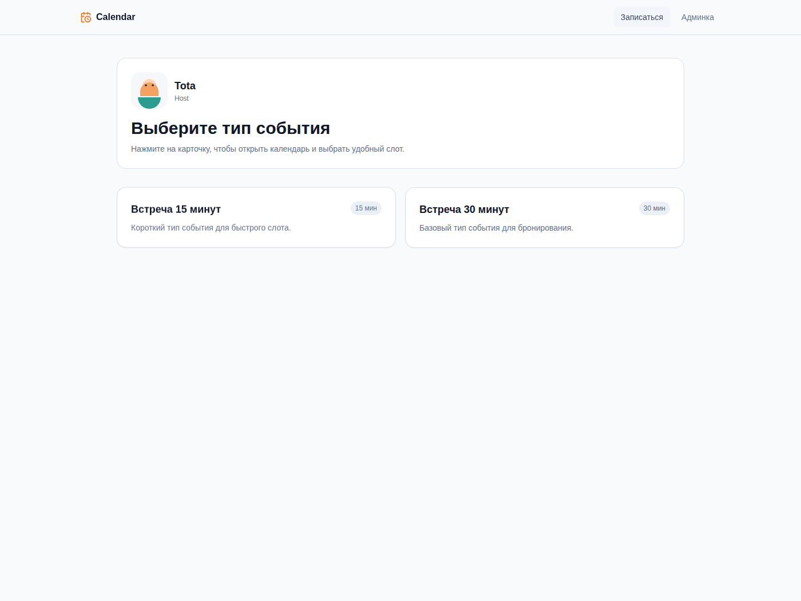
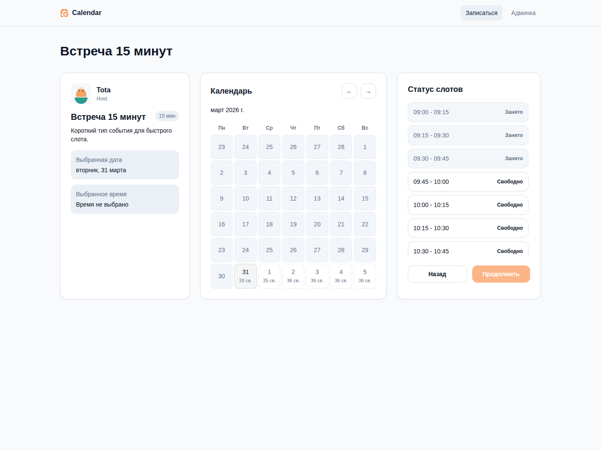

### Hexlet tests and linter status:

#### Описание
Описание проекта
«Запись на звонок» — это упрощенный сервис бронирования времени по мотивам Cal.com.

Cal.com — это сервис, где пользователь публикует доступные интервалы, а другой человек выбирает свободное время и бронирует встречу. У текущего приложения тот же базовый сценарий: владелец публикует доступное время для встреч, а другой пользователь выбирает свободный слот и записывается на звонок.

В проекте нет авторизации, личных кабинетов и интеграций с внешними календарями. Функциональность намеренно ограничена, чтобы сосредоточиться на главном.

В результате должно получиться небольшое, но законченное приложение. Пользователь видит свободные слоты по 30 минут, может выбрать время и оформить запись, а владелец календаря — посмотреть список предстоящих встреч. Этого достаточно, чтобы пройти весь путь от проектирования до запуска сервиса в облаке.

Пример того, что может получиться:

