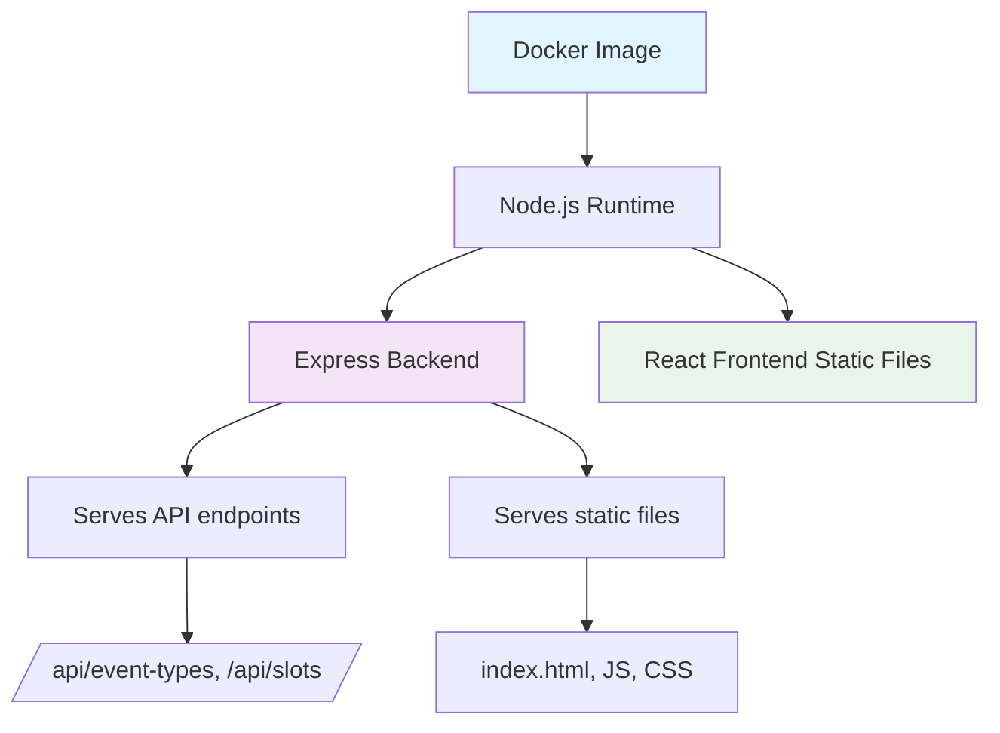

# Финальный план Docker-образа для приложения бронирования

## Обзор
Создание Docker-образа, который объединяет фронтенд (React) и бэкенд (Express) в один контейнер. Приложение будет автоматически запускаться при старте контейнера и использовать порт из переменной окружения PORT.

## Архитектура решения



## Необходимые файлы

### 1. Dockerfile (корень проекта)
```dockerfile
# Многоэтапный Dockerfile для сборки фронтенда и бэкенда в один образ

# Этап 1: Сборка фронтенда
FROM node:20-alpine AS frontend-builder
WORKDIR /app/frontend
COPY frontend/package*.json ./
RUN npm ci --only=production
COPY frontend/ .
RUN npm run build

# Этап 2: Сборка бэкенда  
FROM node:20-alpine AS backend-builder
WORKDIR /app/backend
COPY backend/package*.json ./
RUN npm ci --only=production
COPY backend/ .
RUN npm run build

# Этап 3: Финальный образ
FROM node:20-alpine
ENV NODE_ENV=production
ENV PORT=3000
WORKDIR /app

# Копируем зависимости и скомпилированный бэкенд
COPY --from=backend-builder /app/backend/package*.json ./backend/
COPY --from=backend-builder /app/backend/node_modules ./backend/node_modules
COPY --from=backend-builder /app/backend/dist ./backend/dist
COPY --from=backend-builder /app/backend/src ./backend/src

# Копируем собранный фронтенд в папку public
COPY --from=frontend-builder /app/frontend/dist ./backend/public

# Создаем entrypoint скрипт
RUN echo '#!/bin/sh' > /app/entrypoint.sh && \
    echo 'cd /app/backend' >> /app/entrypoint.sh && \
    echo 'node dist/server.js' >> /app/entrypoint.sh && \
    chmod +x /app/entrypoint.sh

EXPOSE $PORT
CMD ["/app/entrypoint.sh"]
```

### 2. .dockerignore (корень проекта)
```
node_modules
dist
*.log
.env
.DS_Store
.git
*.md
plans/
screenshots/
design/
bad_creating/
generated/
.agents/
.codeassistant/
```

### 3. docker-compose.yml (корень проекта)
```yaml
version: '3.8'

services:
  booking-app:
    build: .
    container_name: booking-app
    ports:
      - "${PORT:-3000}:${PORT:-3000}"
    environment:
      - PORT=${PORT:-3000}
      - NODE_ENV=${NODE_ENV:-production}
    restart: unless-stopped
    networks:
      - booking-network

networks:
  booking-network:
    driver: bridge
```

### 4. .env.example (корень проекта)
```
# Порт приложения
PORT=3000

# Окружение
NODE_ENV=production
```

## Изменения в коде

### Бэкенд (backend/src/app.ts)
```typescript
import path from 'path';
import express, { Application } from 'express';
import cors from 'cors';
import routes from './routes';
import { errorHandler, notFoundHandler, logger } from './middleware';
import { initializeData } from './storage';

export function createApp(): Application {
  const app: Application = express();

  // Middleware
  app.use(cors());
  app.use(express.json());
  app.use(express.urlencoded({ extended: true }));
  app.use(logger);

  // Serve static files from public directory
  app.use(express.static(path.join(__dirname, '../public')));

  // Initialize data storage with predefined data
  initializeData();

  // API Routes
  app.use('/', routes);

  // SPA fallback - serve index.html for any unknown routes
  app.get('*', (req, res) => {
    res.sendFile(path.join(__dirname, '../public/index.html'));
  });

  // 404 handler (should not be reached due to SPA fallback)
  app.use(notFoundHandler);

  // Error handler
  app.use(errorHandler);

  return app;
}
```

### Фронтенд (frontend/src/pages/BookingCatalogPage.tsx и другие)
Заменить:
```typescript
const API_BASE = 'http://localhost:3000';
```
На:
```typescript
const API_BASE = import.meta.env.VITE_API_BASE || '';
```

И добавить в vite.config.ts:
```typescript
import { defineConfig } from 'vite'
import react from '@vitejs/plugin-react'

export default defineConfig({
  plugins: [react()],
  server: {
    proxy: {
      '/api': {
        target: 'http://localhost:3000',
        changeOrigin: true,
        rewrite: (path) => path.replace(/^\/api/, '')
      }
    }
  }
})
```

## Команды для работы

### Сборка и запуск
```bash
# Сборка Docker-образа
docker build -t booking-app .

# Запуск контейнера
docker run -p 3000:3000 booking-app

# Или с docker-compose
docker-compose up -d
```

### Проверка работы
1. Открыть браузер: http://localhost:3000
2. Проверить API: http://localhost:3000/event-types
3. Проверить health endpoint: http://localhost:3000/health

## Переменные окружения
- `PORT`: порт для запуска приложения (по умолчанию 3000)
- `NODE_ENV`: окружение (production/development)

## Особенности реализации
1. **Многоэтапная сборка**: уменьшает размер финального образа
2. **Статические файлы**: бэкенд обслуживает собранный фронтенд
3. **SPA routing**: все неизвестные маршруты перенаправляются на index.html
4. **Переменные окружения**: порт настраивается через PORT

## Следующие шаги
1. Переключиться в code mode для реализации
2. Создать все необходимые файлы
3. Внести изменения в код
4. Протестировать сборку и запуск
5. Обновить документацию проекта