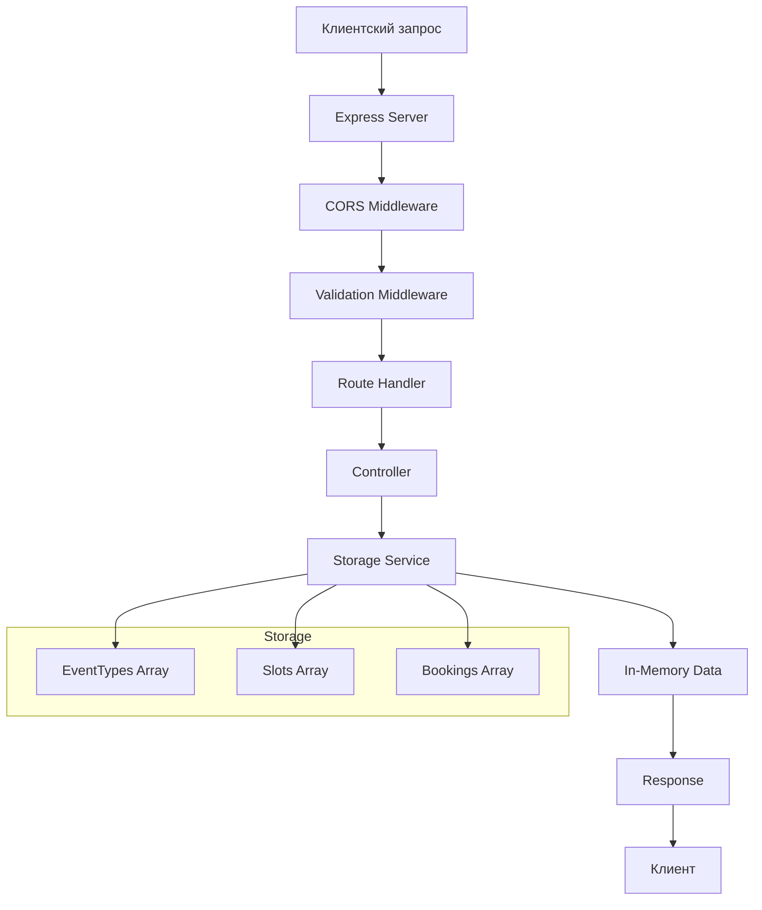

# Архитектура бэкенд приложения для Booking API

## Обзор
Бэкенд приложение будет реализовано на Node.js с использованием Express.js и TypeScript. Приложение будет предоставлять REST API согласно спецификации TypeSpec, хранить данные в памяти (in-memory storage) и работать на порту 3000.

## Технологический стек
- **Runtime**: Node.js (версия 18+)
- **Фреймворк**: Express.js
- **Язык**: TypeScript
- **Хранилище**: In-memory (объекты в памяти приложения)
- **Валидация**: Joi или class-validator
- **CORS**: middleware для кросс-доменных запросов
- **Логирование**: Winston или morgan

## Структура проекта
```
backend/
├── src/
│   ├── models/           # TypeScript интерфейсы и типы
│   │   ├── index.ts
│   │   ├── event-type.model.ts
│   │   ├── slot.model.ts
│   │   ├── booking.model.ts
│   │   └── owner.model.ts
│   ├── storage/          # Хранилище в памяти
│   │   ├── index.ts
│   │   ├── event-type.storage.ts
│   │   ├── slot.storage.ts
│   │   └── booking.storage.ts
│   ├── controllers/      # Контроллеры (обработчики запросов)
│   │   ├── index.ts
│   │   ├── event-type.controller.ts
│   │   ├── slot.controller.ts
│   │   └── booking.controller.ts
│   ├── routes/           # Маршруты Express
│   │   ├── index.ts
│   │   ├── event-type.routes.ts
│   │   ├── slot.routes.ts
│   │   └── booking.routes.ts
│   ├── middleware/       # Промежуточное ПО
│   │   ├── error-handler.ts
│   │   ├── validation.ts
│   │   └── cors.ts
│   ├── utils/           # Вспомогательные функции
│   │   ├── id-generator.ts
│   │   └── date-utils.ts
│   └── app.ts           # Основное приложение Express
├── tests/               # Тесты (будут добавлены позже)
├── package.json
├── tsconfig.json
├── .env.example
└── README.md
```

## Модели данных (соответствуют TypeSpec)
```typescript
// EventType
interface EventType {
  id: string;
  title: string;
  durationMinutes: number;
  text?: string;
}

// Slot
interface Slot {
  id: string;
  eventTypeId: string;
  ownerId: string;
  guestScenarioId: string;
  dateTime: string; // ISO string
}

// Booking
interface Booking {
  id: string;
  dateTime: string;
  eventTypeId: string;
  ownerId: string;
  guestScenarioId: string;
}

// Owner (предопределенные владельцы)
interface Owner {
  id: string;
  name: string;
}

// GuestScenario (предопределенные сценарии)
interface GuestScenario {
  id: string;
  name: string;
}
```

## API Endpoints
Согласно спецификации TypeSpec (`main.tsp`):

### EventTypes
- `POST /event-types` - создание типа события
- `GET /event-types/{eventTypeId}` - получение типа события по ID
- `GET /event-types` - получение списка типов событий

### Slots
- `GET /slots` - получение списка слотов (с фильтром по eventTypeId)

### Bookings
- `POST /bookings` - создание бронирования
- `GET /bookings` - получение списка бронирований (с фильтром по date)

## Предзаполненные данные
При запуске приложения будут автоматически созданы:
1. **Типы событий**:
   - ID: `event-type-1`, Название: "Короткий тип событий для быстрого слота", Длительность: 15 минут
   - ID: `event-type-2`, Название: "Базовый тип события для бронирования", Длительность: 30 минут

2. **Владельцы** (предопределенные):
   - ID: `owner-1`, Имя: "Иван Иванов"
   - ID: `owner-2`, Имя: "Мария Петрова"

3. **Сценарии гостей** (предопределенные):
   - ID: `guest-scenario-1`, Имя: "Первая встреча"
   - ID: `guest-scenario-2`, Имя: "Повторная консультация"

## Хранилище в памяти
Данные будут храниться в объектах JavaScript (массивах) с уникальными ID. При перезапуске сервера данные сбрасываются.

## Валидация
- Входные данные будут валидироваться перед обработкой
- Проверка формата дат, обязательных полей, типов данных
- Возврат соответствующих HTTP статусов (400, 404, 500)

## Интеграция с фронтендом
- CORS будет настроен для разрешения запросов с фронтенда (обычно на порту 5173)
- API будет доступен по адресу `http://localhost:3000`
- Фронтенд сможет делать запросы к бэкенду

## Последовательность реализации
1. Базовая настройка проекта (package.json, tsconfig.json)
2. Модели данных и интерфейсы TypeScript
3. Реализация хранилища в памяти
4. Контроллеры для каждого endpoint
5. Маршруты Express
6. Middleware (CORS, валидация, обработка ошибок)
7. Предзаполнение данных
8. Тестирование endpoints
9. Интеграция с фронтендом
10. Документация и запуск

## Диаграмма потока данных


## Зависимости (package.json)
```json
{
  "dependencies": {
    "express": "^4.18.0",
    "cors": "^2.8.5",
    "joi": "^17.9.0",
    "uuid": "^9.0.0"
  },
  "devDependencies": {
    "@types/express": "^4.17.0",
    "@types/cors": "^2.8.0",
    "@types/node": "^20.0.0",
    "typescript": "^5.0.0",
    "ts-node": "^10.9.0",
    "nodemon": "^3.0.0"
  }
}
```

## Скрипты запуска
- `npm run dev` - запуск в режиме разработки с hot-reload
- `npm run build` - компиляция TypeScript
- `npm start` - запуск скомпилированного приложения

## Следующие шаги
После утверждения этого плана можно переходить к реализации в режиме Code.