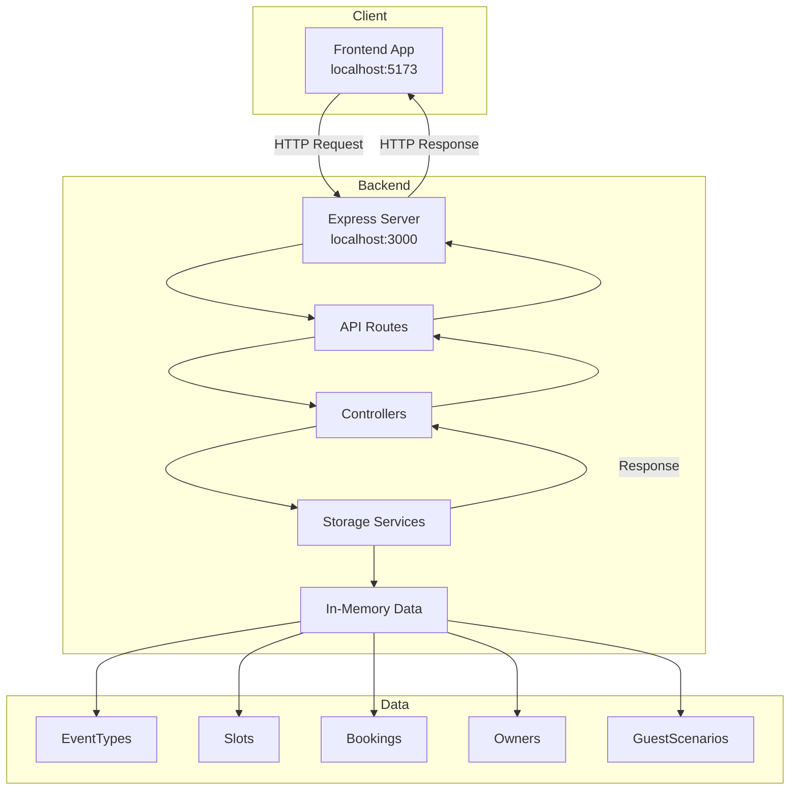

# План создания бэкенд приложения для Booking API

## Предложение по фреймворкам для Node.js

На основе требований (REST API, TypeScript, простота, производительность) предлагаю следующие варианты:

### 1. **Express.js** (РЕКОМЕНДУЕМЫЙ ВАРИАНТ)
- **Плюсы**: 
  - Самый популярный фреймворк для Node.js
  - Минималистичный и гибкий
  - Огромное сообщество и множество middleware
  - Идеален для REST API
  - Легко интегрируется с TypeScript
- **Минусы**:
  - Меньше встроенных возможностей по сравнению с NestJS
  - Требует больше ручной настройки
- **Подходит для**: Быстрой разработки простого API с хранением в памяти

### 2. **Fastify**
- **Плюсы**:
  - Высокая производительность (быстрее Express)
  - Современная архитектура
  - Встроенная валидация через JSON Schema
  - Отличная TypeScript поддержка
- **Минусы**:
  - Меньше сообщество чем у Express
  - Меньше готовых middleware
- **Подходит для**: Высокопроизводительных API

### 3. **NestJS**
- **Плюсы**:
  - Полноценный фреймворк с архитектурой Angular-style
  - Встроенная dependency injection
  - Модульная структура
  - Много встроенных возможностей
- **Минусы**:
  - Избыточен для простого in-memory API
  - Кривая обучения выше
  - Больше boilerplate кода
- **Подходит для**: Комплексных приложений с долгосрочной поддержкой

### 4. **Koa.js**
- **Плюсы**:
  - Современная версия Express от тех же разработчиков
  - Использует async/await
  - Более легковесный
- **Минусы**:
  - Меньше middleware
  - Меньше документации и примеров
- **Подходит для**: Современных приложений с async/await

## Рекомендация: Express.js
**Почему Express.js**:
1. Соответствует вашим требованиям (вы указали Express.js)
2. Идеален для быстрого старта
3. Простая интеграция с TypeScript
4. Легко добавить CORS, валидацию, логирование
5. Большое количество примеров и документации

## Архитектурное решение

### Технологический стек
- **Фреймворк**: Express.js 4.x
- **Язык**: TypeScript 5.x
- **Хранилище**: In-memory (объекты в памяти)
- **Валидация**: Joi 17.x
- **CORS**: cors middleware
- **Генерация ID**: uuid 9.x
- **Запуск в dev**: nodemon + ts-node

### Структура проекта
```
backend/
├── src/
│   ├── models/           # Интерфейсы TypeScript
│   ├── storage/          # In-memory хранилища
│   ├── controllers/      # Обработчики бизнес-логики
│   ├── routes/           # Express маршруты
│   ├── middleware/       # Промежуточное ПО
│   ├── utils/           # Вспомогательные функции
│   ├── app.ts           # Конфигурация Express
│   └── server.ts        # Точка входа
├── tests/               # Тесты (будут позже)
├── package.json
├── tsconfig.json
├── .env.example
└── README.md
```

## API Endpoints (соответствует TypeSpec)

### EventTypes
- `POST /event-types` - создание типа события
- `GET /event-types/{id}` - получение типа события по ID
- `GET /event-types` - список всех типов событий

### Slots
- `GET /slots?eventTypeId={id}` - список слотов (с фильтром по типу события)

### Bookings
- `POST /bookings` - создание бронирования
- `GET /bookings?date={YYYY-MM-DD}` - список бронирований по дате

## Предзаполненные данные
При запуске сервера автоматически создаются:

### Типы событий:
1. **Короткий тип событий для быстрого слота**
   - ID: `event-type-1`
   - Длительность: 15 минут
   - Название: "Короткий тип событий для быстрого слота"

2. **Базовый тип события для бронирования**
   - ID: `event-type-2`
   - Длительность: 30 минут
   - Название: "Базовый тип события для бронирования"

### Владельцы (пример):
- ID: `owner-1`, Имя: "Иван Иванов"
- ID: `owner-2`, Имя: "Мария Петрова"

### Сценарии гостей (пример):
- ID: `guest-scenario-1`, Имя: "Первая встреча"
- ID: `guest-scenario-2`, Имя: "Повторная консультация"

## План реализации

### Фаза 1: Настройка проекта (1-2 часа)
1. Создание структуры папок
2. Инициализация package.json
3. Установка зависимостей
4. Настройка TypeScript

### Фаза 2: Модели и хранилище (2-3 часа)
1. Создание TypeScript интерфейсов
2. Реализация in-memory хранилищ
3. Добавление CRUD операций

### Фаза 3: API Layer (2-3 часа)
1. Создание контроллеров
2. Реализация маршрутов Express
3. Добавление middleware (CORS, валидация)

### Фаза 4: Интеграция и тестирование (1-2 часа)
1. Предзаполнение данных
2. Тестирование endpoints
3. Интеграция с фронтендом

## Диаграмма архитектуры



## Зависимости (package.json)

```json
{
  "name": "booking-backend",
  "version": "1.0.0",
  "description": "Backend API for booking system",
  "main": "dist/server.js",
  "scripts": {
    "dev": "nodemon src/server.ts",
    "build": "tsc",
    "start": "node dist/server.js",
    "test": "jest"
  },
  "dependencies": {
    "express": "^4.18.0",
    "cors": "^2.8.5",
    "joi": "^17.9.0",
    "uuid": "^9.0.0"
  },
  "devDependencies": {
    "@types/express": "^4.17.0",
    "@types/cors": "^2.8.0",
    "@types/node": "^20.0.0",
    "typescript": "^5.0.0",
    "ts-node": "^10.9.0",
    "nodemon": "^3.0.0",
    "@types/uuid": "^9.0.0"
  }
}
```

## Следующие шаги

1. **Утвердите этот план** - если все устраивает, можно переходить к реализации
2. **Переключитесь в режим Code** - для непосредственной реализации
3. **Последовательная реализация** - начнем с настройки проекта и будем двигаться по фазам

## Вопросы для уточнения

1. Нужна ли дополнительная валидация помимо базовой?
2. Требуется ли аутентификация/авторизация (пока не предусмотрено в спецификации)?
3. Нужны ли дополнительные endpoints (например, удаление, обновление)?
4. Какие форматы дат предпочтительны (ISO, timestamp)?

---

**Готов приступить к реализации!** После вашего подтверждения переключусь в режим Code и начну создавать бэкенд приложение.